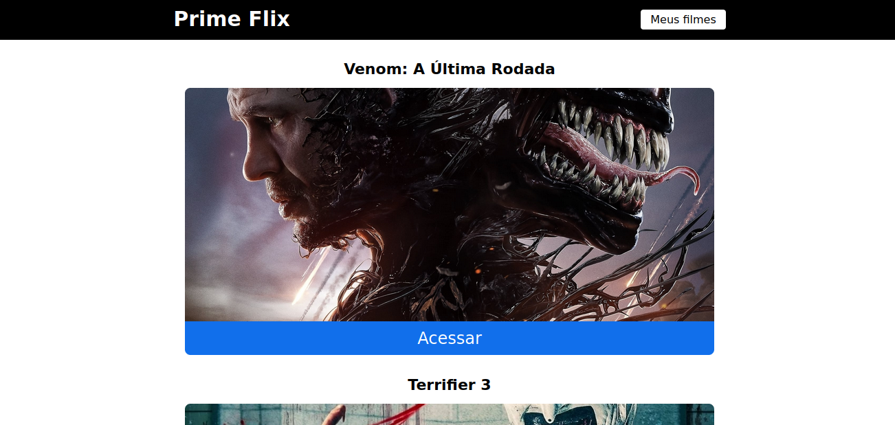

<h1 align="center">PrimeFlix: Plataforma de Filmes</h1>

## Sumário

* [Descrição](#descrição)
* [Requisitos](#requisitos)
* [Ferramentas](#ferramentas)
* [Dificuldades](#dificuldades)
* [Resultados](#resultados)
* [Como_Usar](#como_usar)
* [Conclusão](#conclusao)

## Descrição

PrimeFlix é uma plataforma de filmes desenvolvida em React, projetada para oferecer uma navegação intuitiva e fluida. Com uma interface responsiva, os usuários podem explorar filmes, visualizar detalhes e criar listas de favoritos. A integração com APIs externas garante dados atualizados, proporcionando uma experiência envolvente.

## Requisitos

- [x] Header e Footer
- [x] Uso da Api __themovieDB__
- [x] Pagina Home
- [x] Pagina Filme
- [x] Pagina de Filmes Favoritos
- [x] Botao para Salva um Filme Favorito
- [x] Botao para Excluir um Filme Favorito
- [x] Botao de trailer para ir no youtuber
- [x] Pagina de Erro
- [x] Pop up de feedback do plataforma para o usuario

## Ferramentas

- **React**: Biblioteca JavaScript para criar interfaces de usuário dinâmicas e eficientes.
- **JavaScript**: Linguagem de programação essencial para desenvolvimento web interativo.
- **Node.js**: Ambiente que permite usar JavaScript no lado do servidor para criar aplicações escaláveis.
- **CSS**: Linguagem de estilo usada para definir o visual e layout de páginas web.

## Dificuldades

Tive dificuldade de puxar o json da api do __themovieDB__.

## Resultados

 Pagina Home do Site

 Pagina Filme do Site

 Pagina Filme Favoritos do Site

## Como_Usar

## Conclusão

O desenvolvimento do PrimeFlix demonstrou a combinação eficaz de tecnologias como React, JavaScript, Node.js e CSS para criar uma plataforma de filmes robusta e responsiva. O projeto alcançou com sucesso todos os requisitos propostos, oferecendo aos usuários uma experiência fluida e intuitiva, com funcionalidades como navegação entre páginas, criação de listas de favoritos e integração com a API themovieDB para manter os dados atualizados. Apesar das dificuldades enfrentadas na manipulação de dados da API, a superação desses desafios fortaleceu o projeto e resultou em uma plataforma completa e envolvente, pronta para proporcionar uma experiência de entretenimento aprimorada aos usuários.

